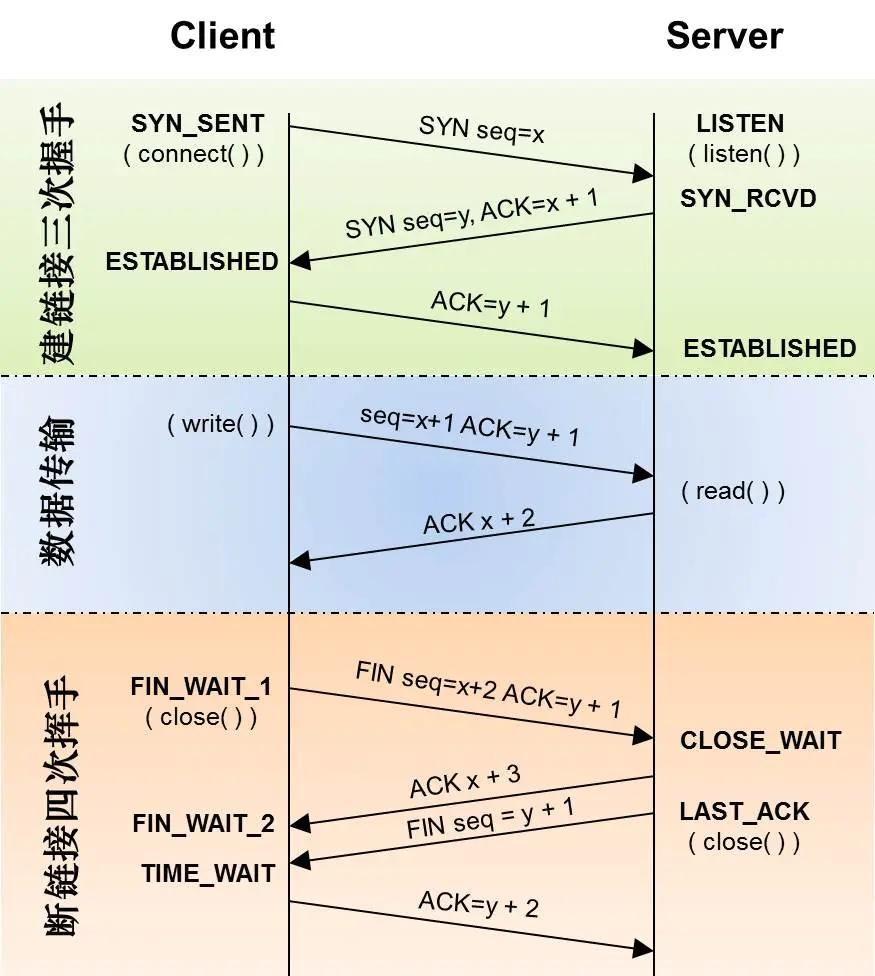
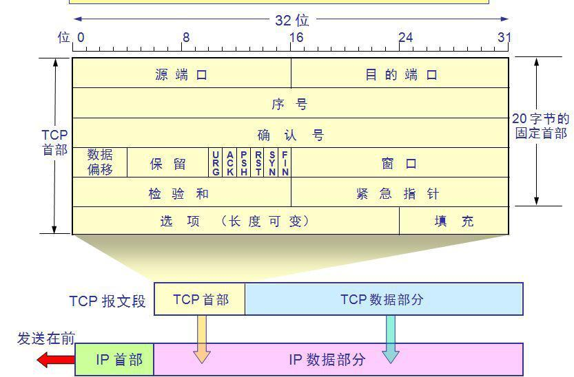

# 网络基础

## ISO 七层网络栈

1. 物理层
2. 数据链路层
3. 网络层
4. 传输层
5. 会话层
6. 表现层
7. 应用层

## 五层模型

## 四层模型

## 其次握手过程

### 其次握手过程中的11种状态

> 图上的状态，加上客户端和服务端的最后close状态；
>
> 出现close状态后，文件描述符并不会立即消失，是经过一定周期，系统回收后才回消失

## TCP的报文格式

重点关注：

1. SYNC
2. ACK
3. FIN

